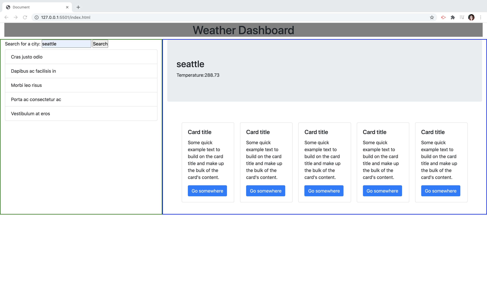

# Weather

## Purpose
Weather is a weather app which allows a user to search by city and find out the five day forcast including the UV index. Previous cities searched are saved in local storage and displayed.

## Built With
* HTML5
* CSS
* Javascript
* jQuery

## Website
[Click here to see deployed Weather Website!](https://kimmulligan.github.io/weather/ "Weather")

## Screenshots
Below is a screenshot

## Contribution
Made by Kim Mulligan

### License
*Copyright ©️ 2020 Weather*

